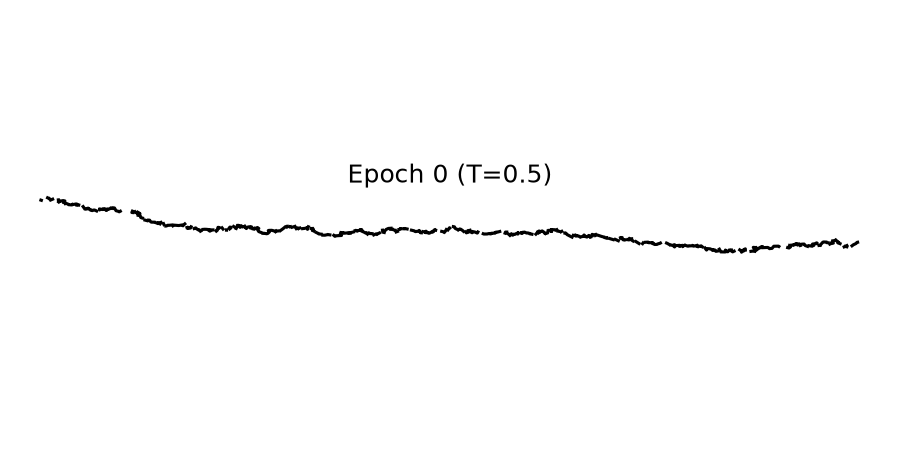
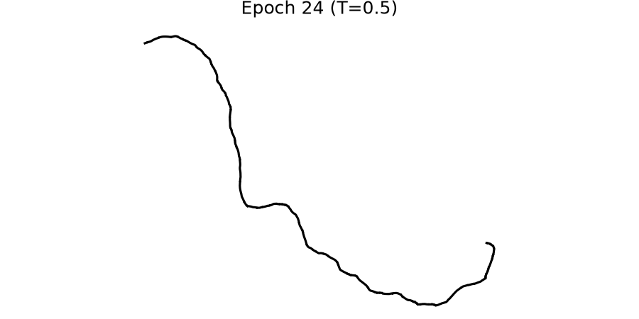
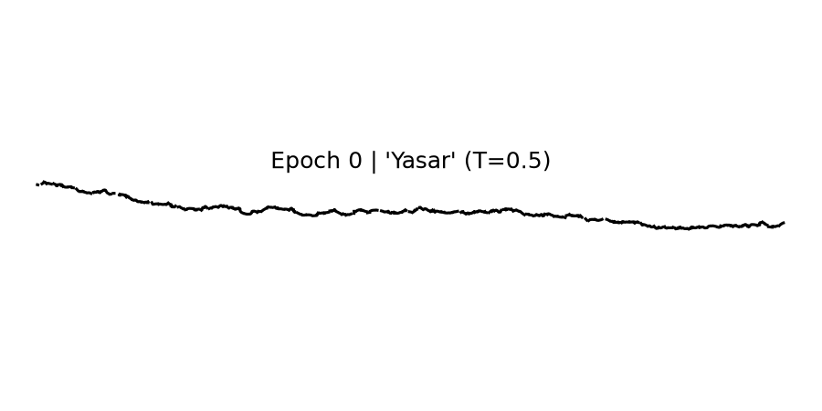
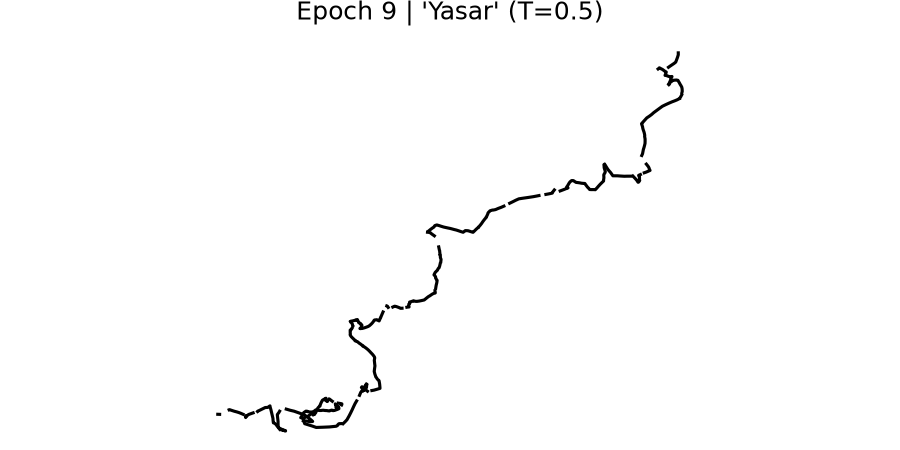

# Handwriting Generation Using RNN + GAN


A PyTorch implementation of **online (stroke‑based) handwriting synthesis** that combines a
**Mixture‑Density Recurrent Neural Network** (Mixture‑Density Network + LSTM) with optional
**Generative Adversarial refinement**, following Alex Graves' seminal paper
*"Generating Sequences With Recurrent Neural Networks"* (Graves, 2013).

The model learns to predict the pen's incremental `(Δx, Δy)` displacement and a binary
`pen_up` (pen‑lift) signal, autoregressively, by emitting the parameters of a *mixture of
bivariate Gaussians* plus a *Bernoulli* term. A second mode of operation uses monotonic
**windowed soft attention** over a character embedding sequence so the strokes can be
**conditioned on arbitrary input text**. An optional 1D‑CNN **discriminator** is trained
adversarially against the generator to make the synthesized strokes sharper and more
human‑like.

> **Online** handwriting means pen trajectories (sequence of points), as opposed to *offline*
> handwriting, which is just a static image. The output here is a sequence of pen movements,
> which is then rendered to an image for visualization.

---

## Results Gallery

The rendered samples below are committed in the repository (under `output/samples/` and
`output_conditioned/samples/`) and show how the strokes improve as training progresses.
They were produced on the bundled **synthetic IAM‑style data** — enough to demonstrate that
the full pipeline learns, with the negative log‑likelihood decreasing steadily for both
modes (see the [Results](#results) section for the numbers).

### Unconditional MDN‑RNN (free‑form stroke synthesis)

| Epoch 0 (random / barely structured) | Epoch 24 (coherent strokes) |
|---|---|
|  |  |

### Conditioned MDN‑RNN with windowed attention

The conditioned model is asked to write a fixed string (`"the quick brown fox"` during
training). Early epochs produce wobbly, misaligned strokes; later epochs start to follow
the conditioning more closely.

| Epoch 0 (informal jitter) | Epoch 9 (beginning of structure) |
|---|---|
|  |  |

> Train on the **real IAM‑OnDB** dataset to obtain human‑legible handwriting; the synthetic
> data only validates that every component (attention, MDN, masking, rendering) learns
> end‑to‑end.

---

## Table of Contents

- [Highlights](#highlights)
- [Results Gallery](#results-gallery)
- [Architecture](#architecture)
- [Repository Layout](#repository-layout)
- [Installation](#installation)
- [Quick Start](#quick-start)
- [Data](#data)
- [Training](#training)
- [Sampling / Inference](#sampling--inference)
- [Evaluation](#evaluation)
- [Results](#results)
- [How the Adversarial (GAN) Component Works](#how-the-adversarial-gan-component-works)
- [Configuration Cheatsheet](#configuration-cheatsheet)
- [Reproducibility & Notes](#reproducibility--notes)
- [License](#license)
- [References](#references)

---

## Highlights

- **Mixture‑Density Network (MDN) output** — instead of regressing a single `(Δx, Δy)`, the
  LSTM predicts `M` bivariate Gaussian components (means, std devs, correlation) plus mixture
  weights, and a Bernoulli `pen_up` logit. This naturally captures the *multi‑modality* of
  handwriting (the same context can lead to several plausible strokes).
- **Numerically stable loss** — `log‑sum‑exp` over mixture components; std devs are
  `exp`‑activated, correlation is `tanh`‑activated, and the log‑likelihood is computed in
  log space to avoid underflow.
- **Text‑conditioned synthesis** with **monotonic windowed attention** (Graves 2013): `K`
  Gaussians slide forward over a character sequence as the stroke is generated, so the model
  learns to align pen strokes to characters *without any alignment supervision*.
- **Optional GAN refinement** — a 1D‑CNN **sequence discriminator** classifies real vs.
  generated stroke sequences; the generator is pushed to fool it via a differentiable
  *expected* stroke (pi‑weighted mixture mean), keeping the adversarial gradient flowing into
  the MDN.
- **Two training modes**:
  - `unconditional` — learns the distribution of strokes and samples free‑form handwriting.
  - `conditioned` — learns to write specific text.
- **Complete pipeline** — XML parsing, normalization, masked batching, training, checkpointing,
  sample rendering, NLL evaluation, and a one‑call `generate_handwriting(text)` demo API.

---

## Architecture

### Unconditional MDN‑RNN

```
        ┌──────────────────────────────────────┐
input   │  3‑layer LSTM (dropout between layers) │   hidden states
(Δx,Δy,pen_up) ─► │  hidden_dim = 256                │ ──► shared
        └─────────────┬────────────────────┘         features
                      │
          ┌───────────┴────────────┐
          ▼                        ▼
   MDN head (Linear)        Pen head (Linear)
   → M×6 params             → 1 Bernoulli logit
   (μx,μy,σx,σy,ρ,π)        → pen_up probability
```

At each timestep the network outputs:

| Output | Shape | Activation | Meaning |
|--------|-------|------------|---------|
| `mu_x`, `mu_y` | `(B, T, M)` | linear | Gaussian means per component |
| `sigma_x`, `sigma_y` | `(B, T, M)` | `exp` | std devs (always > 0) |
| `rho` | `(B, T, M)` | `tanh` | correlation in `(−1, 1)` |
| `pi` | `(B, T, M)` | `softmax` | mixture weights (sum to 1) |
| `pen_up` | `(B, T)` | `sigmoid` | probability of pen lift |

The loss is the **negative log‑likelihood** of the ground‑truth `(Δx, Δy)` under the mixture
of `M` bivariate Gaussians, plus the binary cross‑entropy of `pen_up`.

### Conditioned MDN‑RNN with Windowed Attention

The LSTM input at timestep `t` is the concatenation of the stroke features and an attention
*context* vector computed from the previous LSTM state:

```
                 ┌──────── character embeddings (B, C, E) ────────┐
                 │                                                 │
                 │   K sliding Gaussians (α, β, κ̂)                 │
                 │   κ_t = κ_{t-1} + exp(κ̂_t)   (monotonic)         │
                 │   φ_t(u) = Σ_k α_k · exp(−β_k (κ_t − u)²)       │
                 │   context_t = Σ_u φ_t(u) · char_emb_u            │
                 ▼                                                 │
stroke (Δx,Δy,pen_up) ──► concat ──► LSTM ──► MDN params + pen_up  │
                          ▲                                │       │
                          └──────── context_t ◄── attention(lstm_out_{t-1}, char_emb)
```

Because the attention context at step `t` depends on the LSTM output at step `t−1` and is *itself*
an input to the LSTM at step `t`, the conditioned model is unrolled **one timestep at a time** —
this recurrent coupling cannot be expressed by a single batched LSTM call.

### Sequence Discriminator (GAN)

A stack of **strided 1D convolutions** with LeakyReLU downsamples the temporal axis, followed by
global average pooling and a small MLP classifier that outputs a real/fake probability. It is
trained with binary cross‑entropy and the generator receives an adversarial gradient through a
*differentiable* expected stroke `Σ_m π_m · (μx, μy)` (no non‑differentiable sampling needed).

---

## Repository Layout

```
Handwriting Generation using RNN + GAN/
├── data.py                       # IAM XML parsing, normalization, datasets, rendering
├── models.py                     # MDNRNN, MDNRNNConditioned, WindowedAttention, SequenceDiscriminator
├── losses.py                     # MDN NLL, mixture-mean helper, adversarial BCE losses
├── train.py                      # Training loop (unconditional & conditioned), sampling, ckpts
├── eval.py                       # NLL eval, pre/post-adversarial comparison, demo API
├── generate_synthetic_data.py    # Generate fake IAM-style XML when no real data is available
├── sanity_check.py               # End-to-end pipeline smoke test (parse→norm→render→denorm)
├── verify_model.py               # Shape / numerical-stability checks for MDN + GAN
├── __init__.py                   # Package exports
├── requirements.txt
├── pyproject.toml
├── LICENSE
├── README.md
├── output/                       # Unconditional run: samples, logs, stats, checkpoints
│   ├── samples/                  # epoch_XXXX.png rendered samples
│   ├── log.json                  # per-epoch train/val NLL history
│   └── stats.json                # normalization stats (mean/std of Δx, Δy)
└── output_conditioned/           # Conditioned run: same structure
    ├── samples/
    ├── log.json
    └── stats.json
```

> Checkpoints (`*.pt`) and `__pycache__/` are `.gitignore`d — they are regenerated by training.
> The small `log.json` / `stats.json` files and rendered sample PNGs are kept so the results are
> viewable directly from the repository.

---

## Installation

Requirements: **Python ≥ 3.10** and a CPU or CUDA GPU.

```bash
git clone https://github.com/Yasar-17/Handwriting-Generation-Using-RNN.git
cd "Handwriting-Generation-Using-RNN"

# (recommended) create a virtual environment
python -m venv .venv
# Windows:
.venv\Scripts\activate
# Linux / macOS:
source .venv/bin/activate

pip install -r requirements.txt
```

To verify everything is wired correctly (shapes, activations, numerical stability, gradients):

```bash
python verify_model.py        # MDN-RNN + discriminator checks
python sanity_check.py        # data pipeline round-trip check
```

---

## Quick Start

The fastest way to see the system produce handwriting without the real IAM dataset:

```bash
# 1. Generate synthetic IAM-style XML (only needed once, no download required)
python generate_synthetic_data.py --output_dir ./synthetic_data --num_samples 500

# 2. Train the conditioned model for a few epochs (CPU is fine for a quick run)
python train.py --conditioned \
    --data_dir ./synthetic_data \
    --output_dir ./output_conditioned \
    --epochs 10 --batch_size 16 --hidden_dim 256 --num_layers 3 \
    --num_mixtures 20 --num_windows 10 --char_embed_dim 32 \
    --sample_every 2 --temperature 0.5 \
    --condition_text "hello world"

# 3. Render handwriting for arbitrary text from the trained checkpoint
python eval.py \
    --data_dir ./synthetic_data \
    --stats_path ./output_conditioned/stats.json \
    --ckpt ./output_conditioned/checkpoints/checkpoint_best.pt \
    --comparison_texts "hello world" "the quick brown fox" \
    --temperature 0.5 --output_dir ./eval_output
```

Generated images appear in `output_conditioned/samples/` (during training) and
`eval_output/demo/` (post‑training).

---

## Data

The project reads IAM **On-Line Handwriting** XML files (`<StrokeSet>` / `<Stroke>` /
`<Point>` with `x`, `y`, `time` attributes and a `<Line text="..."/>` element carrying the
transcript). The IAM On-Line Handwriting Database was introduced by Graves & Schmidhuber
(University of Bern); look for "IAM-OnDB" line-level stroke XML files.

### Two ways to get data

1. **Real IAM dataset** — place the line‑level XML files under a directory and pass it with
   `--data_dir`. The script recurses for `*.xml` and splits 80/10/10 (train/val/test), seeded.

2. **Synthetic data** — run `generate_synthetic_data.py` to create realistic‑looking,
   IAM‑formatted XML files with embedded transcripts. This is what powers the Quick Start
   example and lets you train end‑to‑end without downloading anything.

```bash
python generate_synthetic_data.py --output_dir ./synthetic_data --num_samples 1000 --seed 42
```

### Preprocessing

- Absolute `(x, y, pen_up)` → relative `(Δx, Δy, pen_up)` (the first point is `(0, 0, ...)`).
- **Z‑score normalization** of `Δx`, `Δy` using *training‑set* statistics (`mean_x`, `std_x`,
  `mean_y`, `std_y`) saved to `stats.json`. Denormalization reverses this for rendering.
- **Variable‑length batching** with padding and a boolean mask; the loss is masked so padded
  steps contribute nothing.
- **Character vocabulary** (`CharVocab`): printable ASCII + space, with a `0` index reserved
  for padding. Unknown characters map to `0`.

---

## Training

`train.py` supports both unconditional and text‑conditioned modes, with or without the GAN.

### Unconditional (free‑form stroke synthesis)

```bash
python train.py \
    --data_dir ./synthetic_data \
    --output_dir ./output \
    --epochs 50 --batch_size 64 --hidden_dim 256 --num_layers 3 \
    --num_mixtures 20 --dropout 0.2 \
    --lr 1e-3 --clip_grad 5.0 \
    --sample_every 5 --sample_len 800 --temperature 0.5 \
    --seed 42
```

### Conditioned (write specific text)

```bash
python train.py --conditioned \
    --data_dir ./synthetic_data \
    --output_dir ./output_conditioned \
    --epochs 50 --batch_size 64 \
    --hidden_dim 256 --num_layers 3 --num_mixtures 20 \
    --num_windows 10 --char_embed_dim 32 \
    --condition_text "the quick brown fox jumps over the lazy dog" \
    --sample_every 5 --sample_len 1000 --temperature 0.5
```

### With GAN refinement

Add `--use_gan` (and optionally tune the discriminator / adversarial weights):

```bash
python train.py --conditioned --use_gan \
    --data_dir ./synthetic_data --output_dir ./output_conditioned_gan \
    --adv_weight 0.1 --disc_lr 1e-4 \
    --disc_hidden_dim 128 --disc_num_layers 4 --disc_dropout 0.2 \
    ... (other args as above)
```

### Speeding up conditioned training (`--chunk_size`)

The conditioned model has a recurrent attention‑feedback dependency that, in its exact form
(Graves 2013), forces the LSTM to be unrolled one timestep at a time — this dominates CPU
training time. Passing `--chunk_size N > 1` switches to a **truncated‑BPTT‑style
approximation**: the attention context is held constant within each *chunk* of `N`
timesteps and only refreshed between chunks, so the LSTM is invoked `ceil(T / N)` times
instead of `T` times. The monotonic character‑alignment `κ` is still accumulated across
chunks, so global alignment remains monotone; only the *per‑step* context is coarsened.

A micro‑benchmark (CPU, `T=500`, batch 8, 3‑layer LSTM‑256) measuring a forward pass:

| `--chunk_size` | forward time | speedup |
|---:|---:|---:|
| 1 (exact recurrence) | ~1950 ms | 1.0× |
| 16 | ~377 ms | ~5.2× |
| 32 | ~326 ms | ~6.0× |

Sampling (`sample_conditioned`, `eval.py`) always uses `chunk_size=1` for maximum fidelity,
so this flag is a pure **training** speedup knob — recommended values: **8–32**.

```bash
python train.py --conditioned --chunk_size 16 --data_dir ./synthetic_data ...
```

### Outputs

- `output/checkpoints/checkpoint_epoch_XXXX.pt` — per‑epoch checkpoints.
- `output/checkpoints/checkpoint_best.pt` — best (lowest validation total loss) so far.
- `output/samples/epoch_XXXX.png` — rendered generated handwriting every `--sample_every` epochs.
- `output/log.json` — per‑epoch train/val losses and learning rate.
- `output/stats.json` — normalization statistics (needed for inference/eval).

### Resuming

```bash
python train.py --conditioned --data_dir ./synthetic_data \
    --output_dir ./output_conditioned --resume ./output_conditioned/checkpoints/checkpoint_best.pt ...
```

---

## Sampling / Inference

`eval.py` exposes a one‑call API for generating handwriting images:

```python
from eval import generate_handwriting

fig = generate_handwriting(
    text="hello world",
    ckpt_path="./output_conditioned/checkpoints/checkpoint_best.pt",
    stats_path="./output_conditioned/stats.json",
    temperature=0.5,        # lower → more deterministic; higher → more diverse
)
fig.savefig("hello_world.png")
```

Or via the `HandwritingGenerator` class for repeated generation:

```python
from eval import HandwritingGenerator

gen = HandwritingGenerator(
    ckpt_path="./output_conditioned/checkpoints/checkpoint_best.pt",
    stats_path="./output_conditioned/stats.json",
)
fig = gen.generate_handwriting("the quick brown fox", temperature=0.5)
```

### About the sampling temperature

Sampling picks a mixture component from `softmax(pi / T)` and draws from that bivariate
Gaussian, with std devs scaled by `T`:

- **`T` small (< 1)** → the most probable mixture component dominates, strokes are crisper and
  more repetitive.
- **`T` ≈ 1** → faithful to the learned distribution.
- **`T` large (> 1)** → flatter mixture weights, more random/varied (and noisier) strokes.

For conditioned generation the loop also stops early when the pen stays lifted for many
consecutive steps (the model is effectively done writing the text).

---

## Evaluation

```bash
python eval.py \
    --data_dir ./synthetic_data \
    --stats_path ./output_conditioned/stats.json \
    --pre_ckpt ./output_conditioned/checkpoints/checkpoint_best.pt \
    --post_ckpt ./output_conditioned_gan/checkpoints/checkpoint_best.pt \
    --comparison_texts "hello world" "the quick brown fox" \
    --num_samples 3 --temperature 0.5 \
    --output_dir ./eval_output
```

This produces:

1. **Validation NLL** — average MDN negative log‑likelihood on the held‑out split (saved to
   `eval_output/eval_results.json`).
2. **Pre/post‑adversarial comparison images** in `eval_output/comparisons/` showing samples
   from the MDN‑only model vs. the GAN‑refined model side by side.
3. **Demo samples** in `eval_output/demo/` for each requested text.

---

## Results

Training was run for a small number of epochs on synthetic data to validate the full pipeline
(both unconditional and conditioned). The negative log‑likelihood decreases steadily for both
models. The plots below were produced from the committed `output/log.json` /
`output_conditioned/log.json`.

### Unconditional MDN‑RNN val NLL

| Epoch | 0    | 5     | 10    | 15    | 20    | 24    |
|-------|------|-------|-------|-------|-------|-------|
| Val NLL | 2.32 | 0.33 | −0.40 | −0.76 | −0.86 | −0.88 |

### Conditioned MDN‑RNN val NLL

| Epoch | 0    | 1    | 2    | 3    | 4    | 9    |
|-------|------|------|------|------|------|------|
| Val NLL | 2.01 | 0.47 | −0.13 | −0.33 | −0.44 | −0.84 |

> Note: NLL values are negative because we report the **average log‑likelihood per timestep**
> (the NLL is reported as a loss when optimizing, but a *higher* log‑likelihood — i.e. *lower*
> reported number — means the model fits the validation strokes better).

Rendered progression samples (left → earlier epoch, right → later epoch) are kept under
`output/samples/` and `output_conditioned/samples/` so the improvement over training is visible,
e.g.:

```
output_conditioned/samples/epoch_0000.png   # early: noisy, wobbly strokes
output_conditioned/samples/epoch_0009.png   # late:  more coherent handwriting
```

---

## How the Adversarial (GAN) Component Works

The MDN loss optimizes **log‑likelihood**, which makes the model produce *plausible* strokes
but can yield samples that are slightly jittery or unrealistic-looking. The GAN component adds
an adversarial objective to sharpen the output distribution:

1. **Discriminator** (`SequenceDiscriminator`) — a 1D‑temporal CNN that outputs the probability
   that a `(B, T, 3)` stroke sequence is *real* (from the dataset).
2. **Generator** — the MDN‑RNN itself. Its "fake" sequence is the **differentiable expected
   stroke**: `(Σ_m π_m μx, Σ_m π_m μy, pen_up)`. This avoids the non‑differentiable sampling
   step so the adversarial gradient flows back into the mixture parameters.
3. **Training** — each step:
   - Discriminator update: BCE with real sequences labeled 1 and detached fake sequences labeled 0.
   - Generator update: MDN NLL + `adv_weight · adversarial_loss`. The adversarial term encourages
     the expected stroke to look real to the discriminator.

Because the discriminator operates on **stroke sequences** (not images), no differentiable
renderer is needed. The GAN is entirely optional and can be enabled with `--use_gan`.

### Pre‑ vs. post‑adversarial samples

Running `eval.py` with both `--pre_ckpt` (MDN‑only) and `--post_ckpt` (MDN+GAN) produces side‑by‑side
comparison figures so the effect of adversarial training is visible directly.

---

## Configuration Cheatsheet

| Argument | Default | What it controls |
|----------|---------|-------------------|
| `--conditioned` | off | Enable text‑conditioned + attention mode |
| `--hidden_dim` | 256 | LSTM hidden size |
| `--num_layers` | 3 | LSTM layers |
| `--num_mixtures` | 20 | M (`M·6` MDN params) |
| `--num_windows` | 10 | K attention windows (conditioned only) |
| `--char_embed_dim` | 32 | Character embedding size (conditioned only) |
| `--dropout` | 0.2 | Dropout between LSTM layers |
| `--batch_size` | 64 | Minibatch size |
| `--epochs` | 50 | Training epochs |
| `--lr` | 1e‑3 | Generator (MDN‑RNN) learning rate |
| `--clip_grad` | 5.0 | Max global gradient norm |
| `--temperature` | 0.5 | Sampling temperature |
| `--sample_every` | 5 | Render a sample every N epochs |
| `--sample_len` | 800 | Timesteps per generated sample |
| `--condition_text` | "the quick brown fox" | Text sampled during conditioned training |
| `--use_gan` | off | Enable adversarial training |
| `--adv_weight` | 0.1 | Weight of adversarial term in generator loss |
| `--disc_lr` | 1e‑4 | Discriminator learning rate |
| `--disc_hidden_dim` | 128 | Discriminator channel base |
| `--disc_num_layers` | 4 | Conv1D layers in the discriminator |
| `--chunk_size` | 1 | Conditioned training speedup: LSTM call per chunk of `N` steps (1 = exact recurrence). Sampling always uses 1. |
| `--seed` | 42 | RNG seed for reproducibility |
| `--resume` | None | Checkpoint path to resume from |

---

## Reproducibility & Notes

- All training scripts call `torch.manual_seed(seed)` and `np.random.seed(seed)` so runs are
  reproducible given the same seed and hardware.
- The conditioned `forward` runs the LSTM **timestep by timestep** by design (attention feedback),
  so it is noticeably slower than the unconditional model. For long sequences on CPU, prefer the
  unconditional model or use a GPU.
- The discriminator uses a *differentiable* mixture mean — not actual sampling — as the "fake"
  sample. This keeps the adversarial gradient clean while still providing a sharpening signal.
- `weights_only=False` is used when loading checkpoints (they contain optimizer/scheduler state,
  which is not pure tensors). Only load checkpoints you trust.

### Engineered / stabilized details worth noting

- **Bivariate Gaussian log‑prob** computed with `torch.logsumexp` over mixture components to
  avoid catastrophic underflow with 20 components.
- **`one_minus_rho²`** is clamped away from zero; std devs are `exp`‑activated (always > 0),
  correlation is `tanh`‑activated; `pi` is `softmax`‑activated so it sums to 1.
- **Pen probabilities** are clamped away from `0` and `1` before taking logs in the BCE term.
- **Monotonic attention** is enforced via cumulative `κ_t = Σ exp(κ̂_t)` so the window cannot
  move backward through the character sequence.
- **Masking**: padded timesteps are masked out of the NLL so variable‑length sequences in a
  batch do not bias the loss.

---

## License

This project is released under the [MIT License](./LICENSE).

---

## References

- Alex Graves. **"Generating Sequences With Recurrent Neural Networks."** *Neural Computation*,
  2013. — the original formulation of the MDN‑RNN + windowed attention handwriting model.
- IAM On-Line Handwriting Database: A. Graves & J. Schmidhuber, *IAM-OnDB*, University of Bern.
- Bishop, C. M. **"Mixture Density Networks."** Technical Report NCRG/94/004, Aston University, 1994.
- Goodfellow, I. et al. **"Generative Adversarial Nets."** NeurIPS 2014.